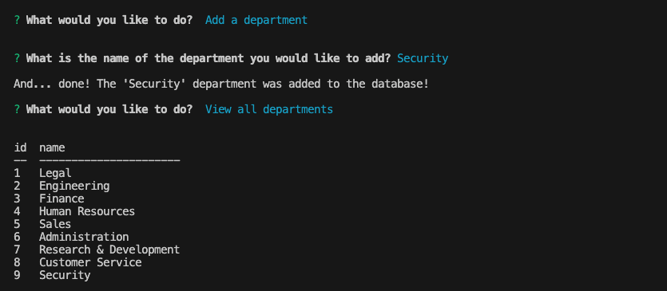

# MySQL Employee Tracker 

## Description 
This command-line tool is intended to assist companies with managing an employee database.  
The goal of this project is to create a Content Management System (CMS) using Node.js, Inquirer, and MySQL.  

The database is mapped according to the following schema:  

This application supports the following functionalities:
1. View all departments in the database
2. View all roles in the database
3. View all employees in the database
4. Add a department 
5. Add a role 
6. Add an employee
7. Update an employee's role

## Table of Contents 
- [Walkthough Video](#walkthrough-video)
- [Installation](#installation)
- [Dependencies](#dependencies)
- [Usage](#usage)
- [Testing](#testing)
- [Contributing](#contributing)
- [License](#license)
- [Questions](#questions)

## Walkthrough Video

Click the following link to view a walkthrough video on the usage of the application: [Walkthrough Video: MySQL Employee Tracker](https://drive.google.com/file/d/17ic6iFgpC2NW9aDnAj3QiKI-5RD0ezqi/view?usp=sharing)  
  
## Installation 

Use the following steps to install and run the application locally:
1. Clone this repository to your local machine. (For reference, visit the [Cloning a Repository](https://docs.github.com/en/repositories/creating-and-managing-repositories/cloning-a-repository) GitHub Docs article.)
2. Run `npm install` in your CLI to download the npm package dependencies. 
3. Run `npm start` on your CLI to intialize the application.
  
## Dependencies
This project requires the following npm package dependencies:
1. [Inquirer v8.2.4](https://www.npmjs.com/package/inquirer/v/8.2.4)
2. [MySQL2 v3.9.1](https://www.npmjs.com/package/mysql2)
  
## Usage 

After launching the application, the user will be prompted to select an action from a list of options. 

Selecting `View all departments`, `View all roles`, or `View all employees` will display a table of the requested data. 
- `View all departments` will display the department name and its department ID.
- `View all roles` will display the role ID, title, department it belongs to, and the salary.
- `View all employees` will display the employee ID, first name, last name, role title, role department, salary, and the manager the respective employee reports to. The `manager` field will show `null` if the associated employee does not have one. 

  
Selecting `Add a department` will prompt the user for the name of department to add, then add the department into the database. 

Selecting `Add a role` will prompt the user to enter the role title, salary, and the department it belongs to, then add the role into the database. The user will be given a list of available departments in the database to choose from.

Selecting `Add an employee` will prompt the user to enter the employee first name, last name, role, and the manager name, then add the employee into the database. The user will be given a list of available roles and managers in the database to choose from. 

Selecting `Update an employee role` will prompt the user to enter the name of the employee to update and which role to assign them to, then update the database. The user will be given a list of available employees and role titles in the database to choose from. 

## Testing 
No test suites have been written for this application. Please refer to the [Installation](#installation) section to run the application locally. 
  
## Contributing
To make contributions to this project:  
1. Fork the repository  
2. Make some commits to improve the application
3. Open a Pull Request on GitHub
4. From there, we can discuss your changes and merge the pull request once your contributions have been approved!

## License 
This GitHub repository is licensed under the MIT license. Please refer to the license documentation [here](https://opensource.org/licenses/MIT).
  
## Questions
This project was created by [dymoy](https://github.com/dymoy).  
For any related questions, please contact me via email at <derekymoy@gmail.com>.